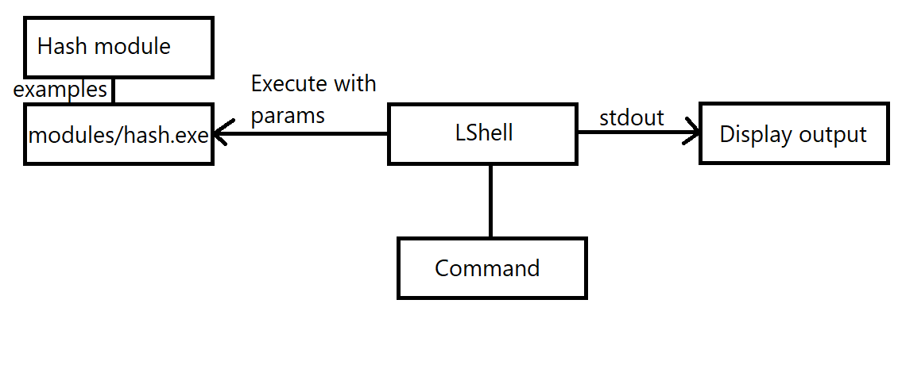

# LShell
LShell is an open-source Bash-like command redirector for Windows.


## What is LShell?
It's a command redirector. You can use Windows and Linux commands, and LShell will redirect and execute them.


## How do I run it?
Download the source, extract it into a folder and use VS 2017 to compile.

Pre-built releases are also available on the [Releases](https://github.com/githubcatw/lshell/releases) page.

## How do I extend it?
You can write a module. Modules are regular command line programs (.exe) or batch files (.bat, .cmd). Modules need to be placed in the ```modules``` folder.


